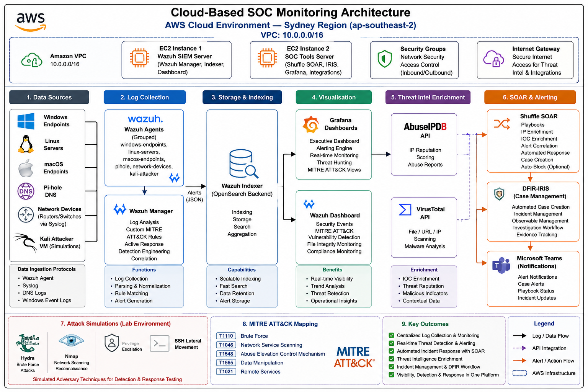
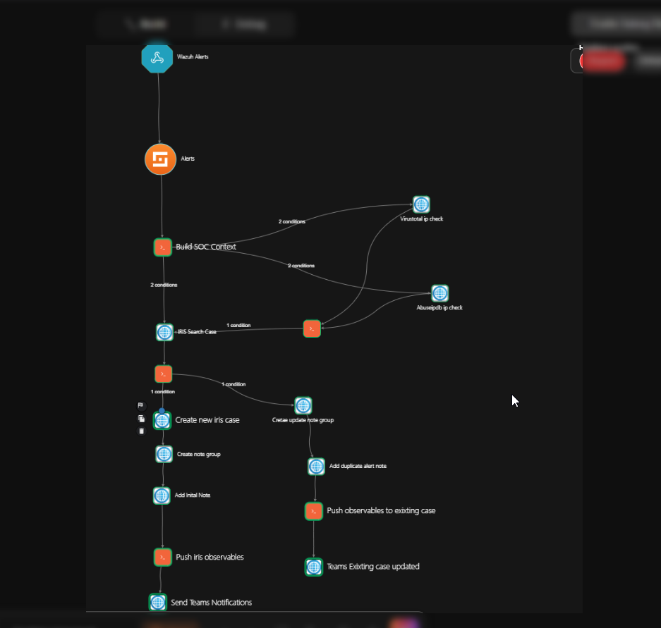
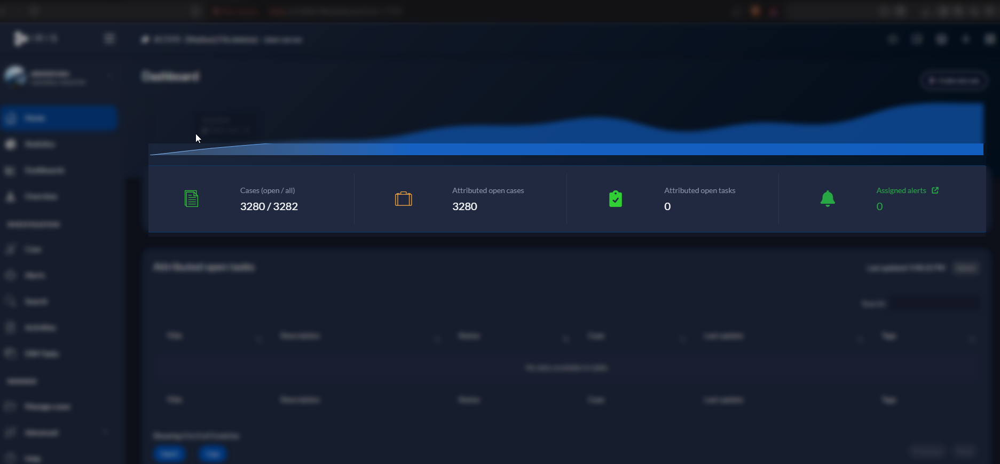

# Automated SOC Lab

## Overview
This lab is Cloud-based cybersecurity monitoring and incident response platform designed to simulate real-world SOC workflows.
This project integrates SIEM, SOAR, DFIR-IRIS, threat intelligence, and automated alerting technologies to detect, analyze, and respond to security events across multiple endpoints and operating systems.
The lab was built using AWS cloud infrastructure and combines Wazuh SIEM, Shuffle SOAR, DFIR-IRIS, Grafana, VirusTotal, AbuseIPDB, and Microsoft Teams integrations to create an end-to-end security monitoring environment.
The platform supports:
1. Centralized log collection and monitoring
2. Automated incident response workflows
3. Threat intelligence enrichment
4. MITRE ATT&CK aligned detections
5. Security event visualization and dashboards
6. Simulated attack detection and investigation

The objective of this project is to develop practical SOC engineering, detection engineering, and incident response skills through hands-on cybersecurity operations and automation.

## Objectives
The primary objectives of this project were:

1. Build a practical cloud-based SOC environment for security monitoring and incident response
2. Centralize logs and security events from multiple operating systems and devices
3. Implement automated alert triage and incident response workflows using SOAR technologies
4. Simulate real-world cyberattacks to test detection and response capabilities
5. Integrate threat intelligence platforms for IOC enrichment and analysis
6. Visualize security data and operational metrics using custom dashboards
7. Develop custom detection rules aligned with the MITRE ATT&CK framework
8. Improve hands-on skills in SIEM engineering, DFIR processes, and SOC operations
9. Gain practical experience with cloud infrastructure, security automation, and threat monitoring

## Technologies Used

| Category                         | Technologies                       |
| -------------------------------- | ---------------------------------- |
| SIEM                             | Wazuh                              |
| SOAR                             | Shuffle                            |
| DFIR & Case Management           | DFIR-IRIS                          |
| Visualization & Dashboards       | Grafana                            |
| Threat Intelligence              | VirusTotal, AbuseIPDB              |
| Cloud Infrastructure             | AWS EC2                            |
| Operating Systems                | Ubuntu Linux, Windows 10/11, macOS |
| Log Sources                      | Syslog, Wazuh Agents               |
| Communication & Alerting         | Microsoft Teams Webhooks           |
| Security Frameworks              | MITRE ATT&CK                       |
| Attack Simulation Tools          | Hydra, Nmap                        |
| Virtualization & Lab Environment | Docker, Proxmox                    |
| Scripting & Automation           | Python, JSON APIs                  |

## Lab Architecture

The Automated SOC Lab was designed using a centralized security monitoring architecture hosted on AWS cloud infrastructure.

The environment consists of two primary servers:
## System Architecture

### SIEM Server

The SIEM server hosts:

* Wazuh Manager
* Wazuh Indexer
* Wazuh Dashboard

This server is responsible for:

* Log collection
* Event correlation
* Threat detection
* Security monitoring
* Alert generation

### SOC Tools Server

The SOC tools server hosts:

* Shuffle SOAR
* DFIR-IRIS
* Grafana

This server is responsible for:

* Security orchestration and automation
* Incident response case management
* Threat intelligence enrichment
* Dashboard visualization and reporting

### Endpoint Monitoring

The platform monitors multiple endpoint types including:

* Windows systems
* Linux systems
* macOS systems
* Network devices
* Syslog-enabled services

### Threat Detection Workflow

1. Security events are generated from monitored endpoints
2. Wazuh collects and analyzes logs
3. Detection rules trigger alerts based on suspicious activity
4. Shuffle SOAR automates incident response workflows
5. Threat intelligence APIs enrich indicators of compromise (IOCs)
6. DFIR-IRIS creates and manages investigation cases
7. Microsoft Teams receives real-time security notifications
8. Grafana visualizes security metrics and alerts

## Features

The Automated SOC Lab includes multiple security monitoring, detection, and incident response capabilities designed to simulate real-world SOC operations.

### Security Monitoring

* Centralized log collection and analysis
* Real-time security event monitoring
* Multi-platform endpoint visibility
* Syslog and agent-based monitoring

### Threat Detection

* Custom Wazuh detection rules
* Brute-force attack detection
* Port scan detection
* Privilege escalation detection
* File integrity monitoring (FIM)
* Suspicious authentication monitoring

### Security Automation

* Automated alert triage workflows
* IOC enrichment using threat intelligence APIs
* Automated incident creation in DFIR-IRIS
* Microsoft Teams security notifications
* Alert deduplication and correlation

### Threat Intelligence Integration

* VirusTotal integration
* AbuseIPDB integration
* IOC reputation analysis
* Automated enrichment of malicious IP addresses

### Visualization & Reporting

* Grafana SOC dashboards
* Security event visualization
* Alert trend monitoring
* Operational monitoring metrics

### Incident Response

* Automated case creation
* Observable management
* Incident tracking workflows
* MITRE ATT&CK technique mapping

### Cloud & Infrastructure

* AWS-based deployment
* Docker containerized services
* Scalable SOC architecture
* Multi-server security operations environment

## Detection & Response Workflows

The Automated SOC Lab uses integrated SIEM and SOAR workflows to automate threat detection, alert enrichment, incident response, and investigation processes.

### Detection Workflow

1. Endpoints and monitored systems generate logs and security events
2. Wazuh agents and Syslog services forward logs to the Wazuh Manager
3. Wazuh analyzes incoming events using built-in and custom detection rules
4. Security alerts are generated based on suspicious activity patterns
5. Alerts are forwarded to Shuffle SOAR for automated processing

### Automated Response Workflow

Shuffle SOAR automates multiple incident response actions including:

* Alert parsing and validation
* Threat intelligence enrichment using VirusTotal and AbuseIPDB
* IOC extraction and analysis
* Automated DFIR-IRIS case creation
* Security alert forwarding to Microsoft Teams
* Alert deduplication and correlation

### Incident Investigation Workflow

Once incidents are created:

* DFIR-IRIS manages investigation cases
* Observables such as IP addresses and hostnames are added automatically
* Analysts can review enriched indicators of compromise
* Incidents are categorized based on severity levels
* MITRE ATT&CK techniques are mapped to detected activities

### Severity Classification

The platform uses severity-based alert classification:

| Wazuh Alert Level | Severity |
| ----------------- | -------- |
| 13–15             | Critical |
| 10–12             | High     |
| 7–9               | Medium   |
| 0–6               | Low      |

### Supported Detection Scenarios

The lab currently supports detection for:

* SSH brute-force attacks
* Network reconnaissance and port scanning
* Privilege escalation attempts
* Suspicious authentication activity
* File integrity modifications
* Lateral movement activity

## Attack Simulations

To validate the effectiveness of the detection and response workflows, multiple controlled cyberattack simulations were performed within the lab environment.

The simulations were designed to test the SIEM, SOAR, alerting, and incident response capabilities of the platform.

### SSH Brute-Force Attack

A brute-force attack simulation was performed using Hydra against a Linux target system.

**Detection Results:**

* Multiple failed authentication attempts detected
* Wazuh generated high-severity alerts
* MITRE ATT&CK technique mapping applied
* Shuffle SOAR triggered automated workflows
* DFIR-IRIS case created automatically
* Microsoft Teams notifications generated

**MITRE ATT&CK Mapping:**

* T1110 – Brute Force

### Network Reconnaissance & Port Scanning

Nmap scans were performed against monitored systems to simulate attacker reconnaissance activity.

**Detection Results:**

* Port scanning activity identified
* Custom detection rules triggered alerts
* Suspicious scanning behavior logged and visualized in dashboards

**MITRE ATT&CK Mapping:**

* T1046 – Network Service Scanning

### Privilege Escalation Simulation

Privilege escalation attempts were simulated using elevated sudo commands and suspicious administrative actions.

**Detection Results:**

* Unauthorized privilege escalation behavior detected
* High-severity alerts generated
* Incident workflows triggered automatically

**MITRE ATT&CK Mapping:**

* T1548 – Abuse Elevation Control Mechanism

### File Integrity Monitoring (FIM) Simulation

Critical system file modifications were performed to validate file integrity monitoring capabilities.

**Detection Results:**

* Unauthorized file modifications detected
* Wazuh FIM alerts triggered
* Alert visualization displayed in Grafana dashboards

**MITRE ATT&CK Mapping:**

* T1565 – Data Manipulation

### Lateral Movement Simulation

SSH-based lateral movement activity was simulated between monitored systems.

**Detection Results:**

* Suspicious remote authentication behavior detected
* Correlated alerts generated across systems
* Incident workflows initiated for investigation

**MITRE ATT&CK Mapping:**

* T1021 – Remote Services

## Threat Intelligence Integrations

The Automated SOC Lab integrates external threat intelligence platforms to enrich security alerts and improve incident investigation capabilities.

Threat intelligence enrichment enables analysts to identify potentially malicious indicators of compromise (IOCs) and gain additional context during investigations.

### VirusTotal Integration

VirusTotal was integrated into the SOAR workflow to analyze suspicious indicators including:

* IP addresses
* Domains
* File hashes
* URLs

The integration automatically retrieves:

* Malicious detection counts
* Reputation analysis
* Threat classification information
* Community intelligence data

This allows analysts to quickly determine whether an indicator has been previously associated with malicious activity.

### AbuseIPDB Integration

AbuseIPDB was integrated to evaluate the reputation of suspicious IP addresses detected within security events.

The platform provides:

* Abuse confidence scores
* Geolocation information
* Historical abuse reports
* Threat reputation analysis

This information is automatically included in the incident response workflow to support faster decision-making.

### Automated IOC Enrichment Workflow

When suspicious activity is detected:

1. Shuffle SOAR extracts indicators from Wazuh alerts
2. Indicators are automatically submitted to VirusTotal and AbuseIPDB
3. Threat intelligence data is retrieved and processed
4. Enriched results are attached to DFIR-IRIS investigation cases
5. Security teams receive enriched alerts through Microsoft Teams notifications

### Benefits of Threat Intelligence Integration

The integration of threat intelligence services improves:

* Incident investigation efficiency
* IOC validation and prioritization
* Threat visibility and context
* SOC response capabilities
* Analyst decision-making processes

## SIEM Dashboards

Grafana dashboards were implemented to provide centralized visualization and monitoring of security events, alerts, and operational metrics across the SOC environment.

The dashboards enable analysts to quickly identify suspicious activity, monitor alert trends, and gain visibility into the overall security posture of the lab environment.

### Dashboard Features

The dashboards include visualization panels for:

* Security alert severity distribution
* Real-time event monitoring
* Threat activity trends
* Authentication and login events
* Brute-force attack detection
* File integrity monitoring alerts
* Endpoint activity monitoring
* Incident response metrics

### Wazuh Integration

Grafana was connected to the Wazuh Indexer using OpenSearch data sources to visualize SIEM data collected from monitored endpoints.

The integration supports:

* Real-time querying of security events
* Alert filtering and correlation
* Historical log analysis
* Operational monitoring dashboards

### Security Monitoring Benefits

The dashboards improve SOC visibility by enabling:

* Faster identification of suspicious activity
* Improved situational awareness
* Centralized monitoring across multiple systems
* Security event trend analysis
* Operational reporting and visualization

### Real-Time Alert Monitoring

The dashboards provide near real-time updates for:

* High-severity security alerts
* Active incidents
* Threat intelligence matches
* Endpoint activity
* Detection rule triggers

This allows analysts to rapidly respond to security events and monitor incident progression within the environment.

## SOAR Automation

Shuffle SOAR was implemented to automate security operations workflows and reduce manual incident response activities within the SOC environment.

The automation workflows process alerts generated by Wazuh and perform multiple response and enrichment actions automatically.

### Automated SOAR Capabilities

The SOAR workflows perform:

* Alert parsing and validation
* IOC extraction from security events
* Threat intelligence enrichment
* Automated incident creation
* Security alert forwarding
* Alert deduplication and correlation

### Integrated Workflow Actions

When suspicious activity is detected:

1. Wazuh generates a security alert
2. Shuffle receives the alert through webhook integrations
3. Indicators of compromise are extracted automatically
4. Threat intelligence lookups are performed using VirusTotal and AbuseIPDB
5. DFIR-IRIS cases are created automatically
6. Microsoft Teams notifications are sent to analysts
7. Investigation observables are added to incidents

### Benefits of SOAR Integration

The automation platform improves:

* Incident response speed
* Alert handling efficiency
* Threat investigation workflows
* Security operations scalability
* SOC analyst productivity

## DFIR & Incident Management

DFIR-IRIS was implemented as the incident response and case management platform for handling security investigations within the Automated SOC Lab.

The platform centralizes incident tracking, observable management, and investigation workflows.

### Incident Response Capabilities

The DFIR platform supports:

* Automated case creation
* Incident severity classification
* Observable management
* Investigation tracking
* Threat intelligence enrichment
* Security event documentation

### Automated Case Creation

When high-priority alerts are detected:

* Shuffle SOAR automatically creates investigation cases
* Relevant indicators are attached to incidents
* Alert metadata is included in case details
* Incidents are categorized based on severity

### Observable Management

The platform automatically stores:

* Suspicious IP addresses
* Hostnames
* Usernames
* Alert details
* Threat intelligence results

This enables analysts to investigate and correlate security events more efficiently.

### Incident Lifecycle Management

The DFIR workflow supports:

* Detection
* Triage
* Investigation
* Containment tracking
* Documentation
* Incident closure

## MITRE ATT&CK Mapping

The Automated SOC Lab aligns detection capabilities with the MITRE ATT&CK framework to improve threat classification and security monitoring visibility.

MITRE ATT&CK mappings were applied to custom detection rules and simulated attack scenarios.

### Implemented MITRE ATT&CK Techniques

| Technique ID | Technique Name                    | Detection Scenario            |
| ------------ | --------------------------------- | ----------------------------- |
| T1110        | Brute Force                       | SSH brute-force attacks       |
| T1046        | Network Service Scanning          | Nmap reconnaissance scans     |
| T1548        | Abuse Elevation Control Mechanism | Privilege escalation attempts |
| T1565        | Data Manipulation                 | File integrity modification   |
| T1021        | Remote Services                   | SSH lateral movement          |

### Benefits of MITRE ATT&CK Alignment

The framework improves:

* Threat detection classification
* Security event analysis
* Adversary behavior mapping
* Incident investigation workflows
* SOC reporting and visibility

### Detection Engineering

Custom Wazuh detection rules were developed to:

* Identify suspicious attack patterns
* Reduce false positives
* Improve detection accuracy
* Support automated incident response workflows

## Project Outcomes

The Automated SOC Lab successfully demonstrated the deployment and operation of an integrated SOC environment using SIEM, SOAR, DFIR, and threat intelligence technologies.

### Key Achievements

* Successfully deployed a cloud-based SOC architecture on AWS
* Centralized monitoring for multiple operating systems and endpoints
* Implemented automated incident response workflows
* Integrated external threat intelligence services
* Developed custom detection rules aligned with MITRE ATT&CK
* Simulated and detected multiple cyberattack scenarios
* Built operational Grafana SOC dashboards
* Automated DFIR-IRIS incident creation and enrichment

### Skills Developed

This project strengthened practical skills in:

* SIEM engineering
* SOC operations
* Detection engineering
* Threat monitoring
* Incident response
* Threat intelligence integration
* Cloud security
* Security automation
* DFIR workflows

### Operational Impact

The integrated workflows improved:

* Alert visibility
* Incident response efficiency
* Investigation speed
* Security event correlation
* SOC operational awareness

## Screenshots

The repository includes screenshots demonstrating:

* Wazuh security alerts
* Grafana dashboards
* Shuffle SOAR workflows
* DFIR-IRIS incidents
* Threat intelligence enrichment
* Microsoft Teams notifications
* Attack simulation detections
* SOC monitoring environment

## Future Improvements

Planned future enhancements for the Automated SOC Lab include:

* Advanced threat hunting workflows
* EDR integration
* Machine learning-based anomaly detection
* Additional threat intelligence feeds
* Automated containment actions
* Expanded attack simulation scenarios
* Cloud-native monitoring integrations
* Improved detection engineering pipelines
* Threat hunting dashboards
* Multi-tenant SOC capabilities

## Disclaimer

This project was developed for educational, research, and cybersecurity training purposes only.

All attack simulations and testing activities were conducted within controlled lab environments owned or authorized by the project team.

No unauthorized systems or third-party environments were targeted during the development or testing of this project.

## Project Team

This project was developed collaboratively as part of a cybersecurity SOC automation and incident response lab environment.

### Team Members

* Bishnu Timilsaina
* Binod Gurung
* Roshan Chaudhary
* Amrit Rai

### Primary Contributions

**Bishnu Timilsaina**

* Shuffle SOAR workflow development
* Alert enrichment automation
* DFIR-IRIS integration
* Incident deduplication logic
* Attack simulation testing
* Detection workflow validation

Additional contributions from team members included infrastructure deployment, dashboard visualization, monitoring configuration, testing, and project documentation.

---

## Connect With Me

LinkedIn: https://www.linkedin.com/in/bishnu-timilsaina/

GitHub: https://github.com/Bataas/
