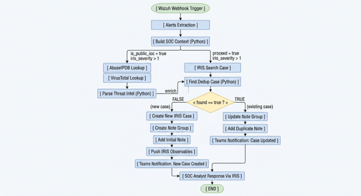
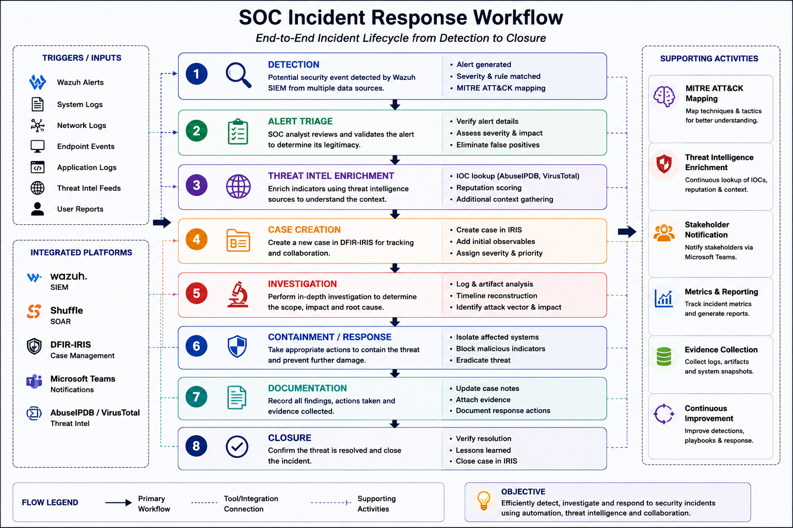

# Architecture Diagrams

This directory contains architecture diagrams and workflow visualizations for the Automated SOC Lab project.

The diagrams demonstrate the cloud infrastructure, SIEM data flow, SOAR automation logic, incident response processes, and integrated SOC operations implemented within the lab environment.

---

# System Architecture

Displays the overall cloud-based SOC infrastructure including:

* AWS-hosted environment
* Wazuh SIEM components
* Shuffle SOAR integration
* DFIR-IRIS platform
* Grafana dashboards
* Threat intelligence services
* Microsoft Teams notifications
* Endpoint monitoring architecture

  

---

# Alert Flow Diagram

Demonstrates the end-to-end security alert processing pipeline including:

* Alert ingestion
* Parsing and enrichment
* Threat intelligence lookups
* Incident deduplication
* Case management workflows
* Notification delivery

  

---

# Incident Response Workflow

Illustrates the SOC incident response lifecycle including:

* Detection
* Triage
* Enrichment
* Investigation
* Response
* Documentation
* Incident closure

  

---

# Shuffle SOAR Workflow

Shows the implemented Shuffle SOAR automation workflow used for:

* Automated alert processing
* IOC enrichment
* DFIR-IRIS integration
* Observable management
* Microsoft Teams notifications
* Security orchestration workflows

  

---

# Purpose

These diagrams provide architectural and operational visibility into the Automated SOC Lab environment and demonstrate practical implementation of:

* SIEM engineering
* Detection engineering
* Security orchestration
* Incident response automation
* Threat intelligence integration
* SOC operations workflows
