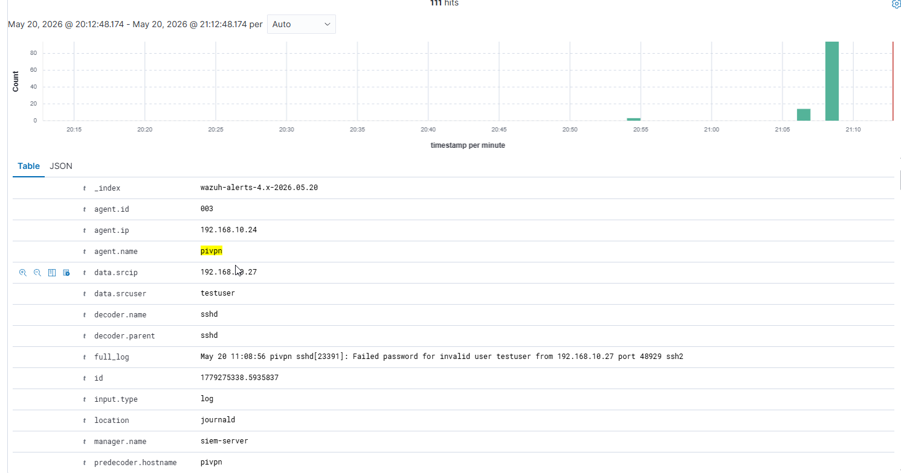
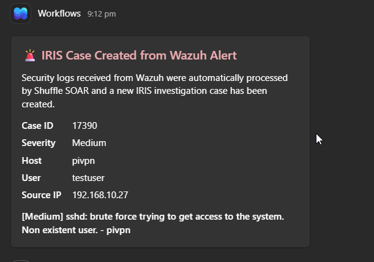
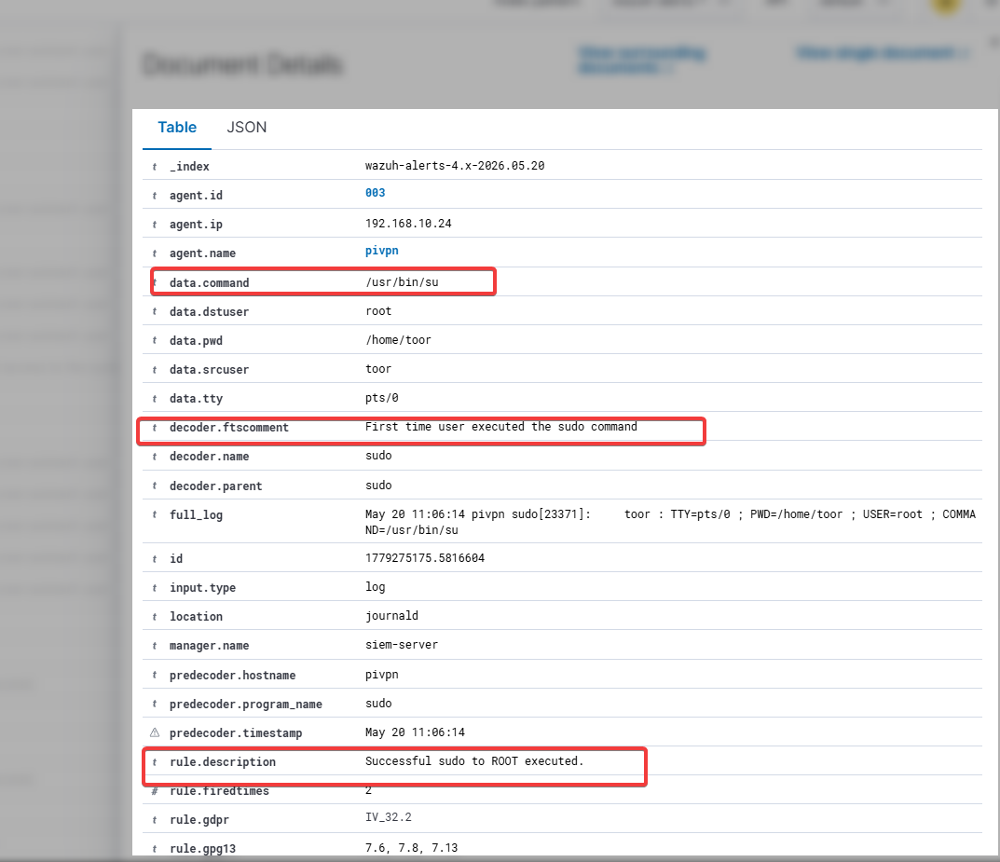
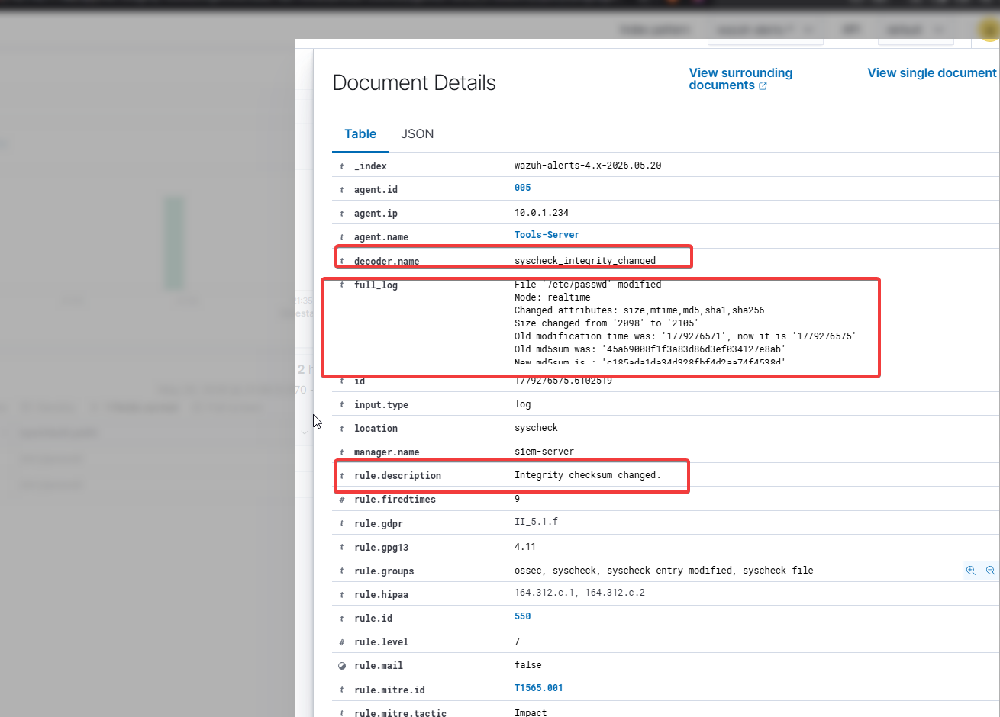
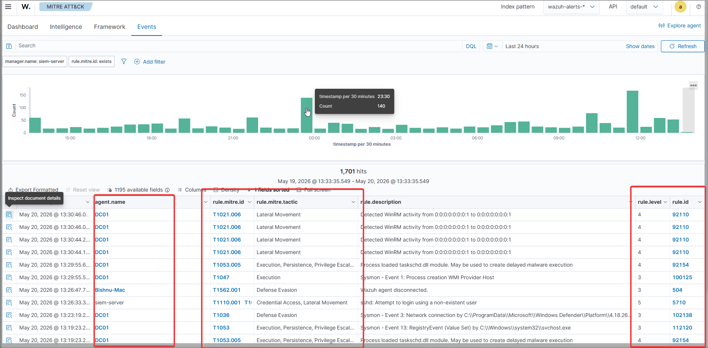
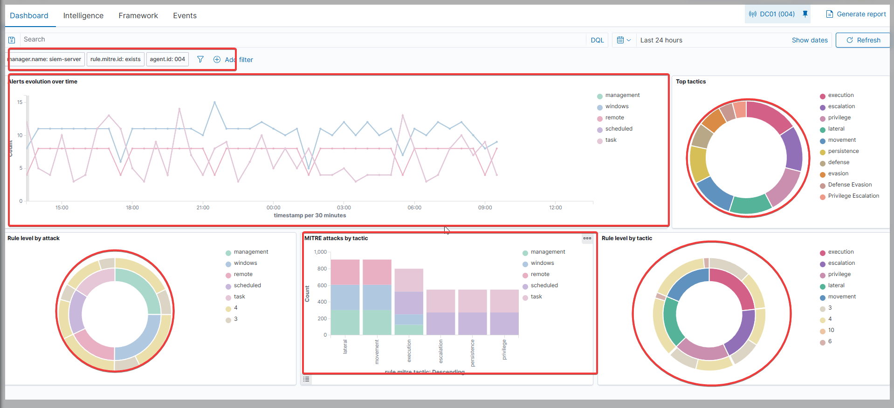

# Detection Engineering

This directory contains detection validation evidence, alert workflows, MITRE ATT&CK mappings, and attack simulation results from the Automated SOC Lab environment.

The detections were tested against simulated attack activity to validate monitoring visibility, alert generation, threat enrichment, incident creation, and automated SOC response workflows.

---

# Detection Pipeline

The lab detection workflow operates as follows:

1. Endpoint and system activity is collected by Wazuh agents
2. Wazuh analyzes logs and security telemetry
3. Detection rules generate security alerts
4. Shuffle SOAR processes and enriches alerts automatically
5. Threat intelligence lookups are performed using VirusTotal and AbuseIPDB
6. DFIR-IRIS cases are created or updated
7. Microsoft Teams notifications are sent to analysts
8. Events and alerts are visualized in Grafana dashboards

---

# Detection Sources

The environment primarily utilizes:

* Wazuh SIEM detection capabilities
* SOCFortress Wazuh detection rules
* MITRE ATT&CK aligned detections
* Custom alert enrichment and automation workflows

The project focused on operationalizing and validating detections within a practical SOC environment rather than building entirely custom detections from scratch.

---

# SSH Brute-Force Detection

This detection validates monitoring of repeated SSH authentication failures and brute-force login activity against Linux systems.

## Detection Evidence

  

## Detection Results

* Multiple failed SSH authentication attempts detected
* Wazuh generated high-severity authentication alerts
* Shuffle SOAR triggered automated enrichment workflows
* Source IP reputation checks were performed
* DFIR-IRIS incidents were automatically created
* Teams notifications were generated for analyst visibility

## MITRE ATT&CK Mapping

| Technique ID | Technique   |
| ------------ | ----------- |
| T1110        | Brute Force |

---

# Teams Alert Notification

Demonstrates automated Microsoft Teams alert delivery from the SOAR workflow after detection processing and enrichment.

  

## Workflow Validation

* Alert severity included in notification
* Detection context automatically summarized
* Source IP intelligence enrichment attached
* Automated SOC alert delivery validated

---

# Privilege Escalation Detection

This detection validates monitoring of suspicious privilege escalation activity and unauthorized elevated command execution.

  

## Detection Results

* Suspicious sudo activity identified
* Elevated command execution monitored
* High-severity alerts generated
* Automated incident workflows triggered
* Alert data forwarded to IRIS and Teams

## MITRE ATT&CK Mapping

| Technique ID | Technique                         |
| ------------ | --------------------------------- |
| T1548        | Abuse Elevation Control Mechanism |

---

# File Integrity Monitoring (FIM)

This detection validates Wazuh File Integrity Monitoring (FIM) capabilities by monitoring unauthorized changes to protected system files.

  

## Detection Results

* Critical file modifications detected
* File integrity alerts generated successfully
* Monitored file changes visualized in dashboards
* Alert pipeline validated through SOAR automation

## MITRE ATT&CK Mapping

| Technique ID | Technique         |
| ------------ | ----------------- |
| T1565        | Data Manipulation |

---

# Lateral Movement Detection

This detection validates monitoring of suspicious SSH remote access and cross-system authentication activity.

  

## Detection Results

* SSH remote access activity detected
* Cross-system authentication events monitored
* Suspicious access patterns identified
* Automated alert enrichment workflows triggered

## MITRE ATT&CK Mapping

| Technique ID | Technique       |
| ------------ | --------------- |
| T1021        | Remote Services |

---

# MITRE ATT&CK Mapping

The implemented detections were mapped against relevant MITRE ATT&CK techniques to align monitoring visibility with known adversary behaviors.

  

| Technique ID | Technique Name                    | Detection Scenario        |
| ------------ | --------------------------------- | ------------------------- |
| T1110        | Brute Force                       | SSH brute-force attacks   |
| T1548        | Abuse Elevation Control Mechanism | Privilege escalation      |
| T1565        | Data Manipulation                 | File integrity monitoring |
| T1021        | Remote Services                   | SSH lateral movement      |

---

# Detection Summary

The validated detection workflows demonstrated the capability of the SOC environment to:

* Detect suspicious authentication activity
* Monitor privilege escalation attempts
* Identify unauthorized system modifications
* Detect lateral movement behavior
* Trigger automated incident response workflows
* Generate real-time analyst notifications
* Enrich alerts using threat intelligence platforms
* Map detections to MITRE ATT&CK techniques

The environment integrates SIEM monitoring, SOAR automation, DFIR case management, and threat intelligence enrichment to simulate practical SOC operations and incident response workflows.

---

# Purpose

The detections were implemented and validated to:

* Improve SOC monitoring visibility
* Support automated incident response
* Validate attack simulation scenarios
* Demonstrate detection engineering workflows
* Simulate real-world SOC operations
* Improve investigation and triage capabilities

All detection testing activities were performed within isolated and authorized lab environments for educational and research purposes only.
