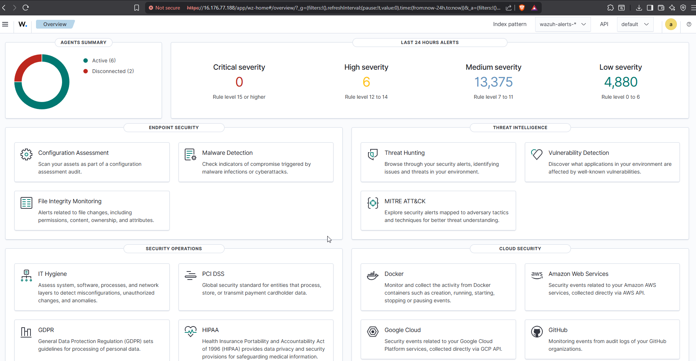
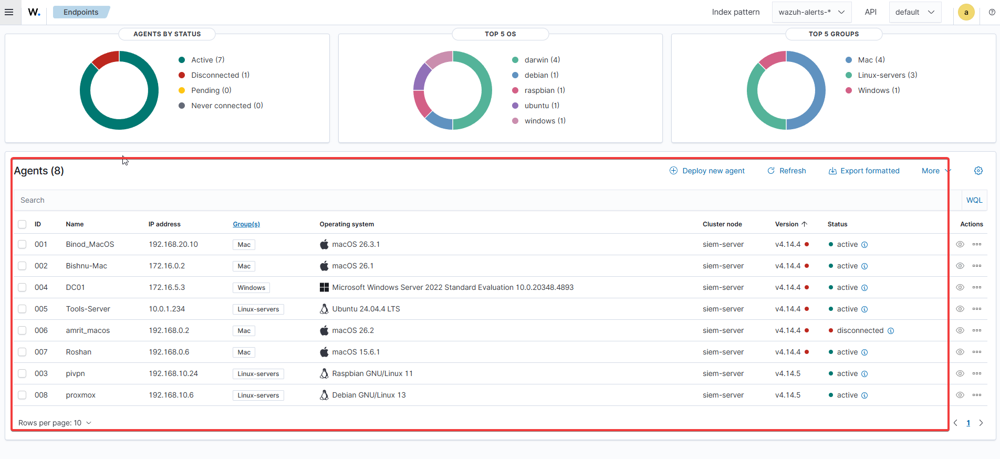
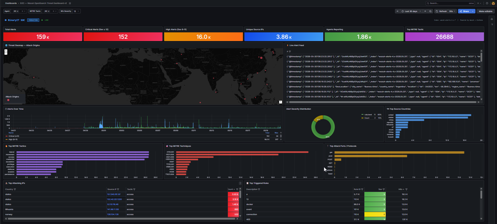
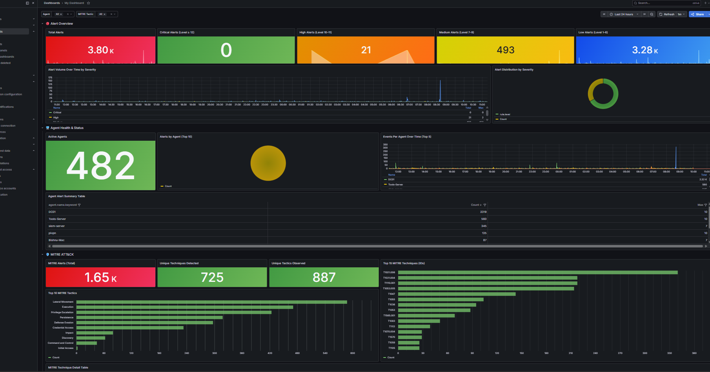
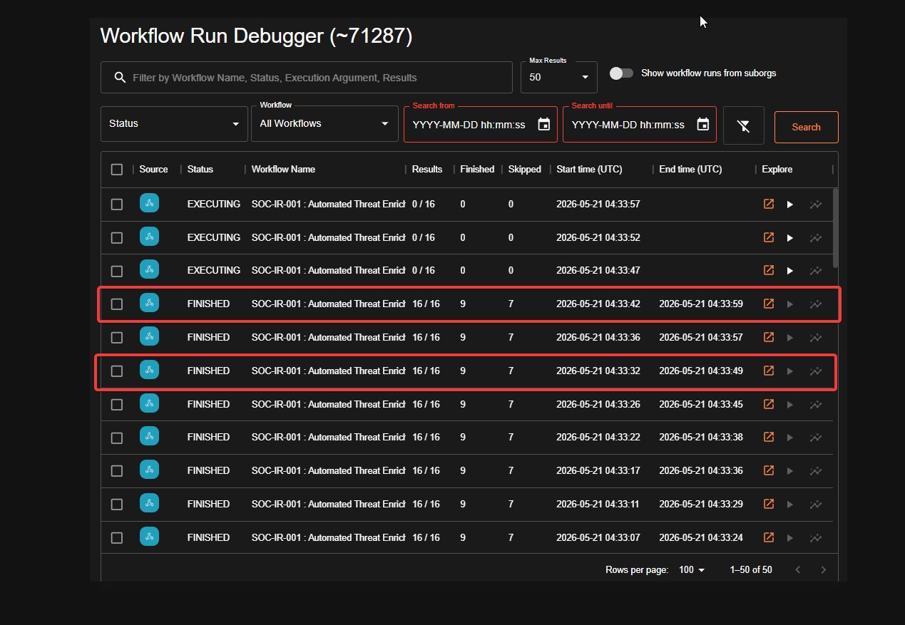
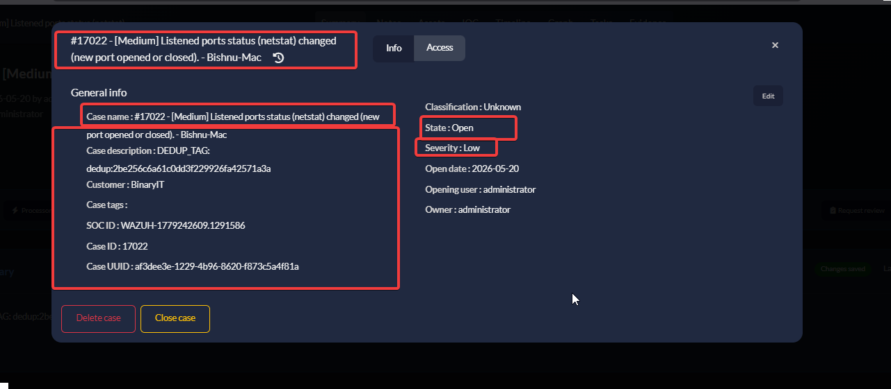
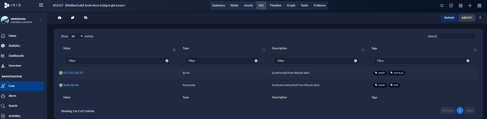
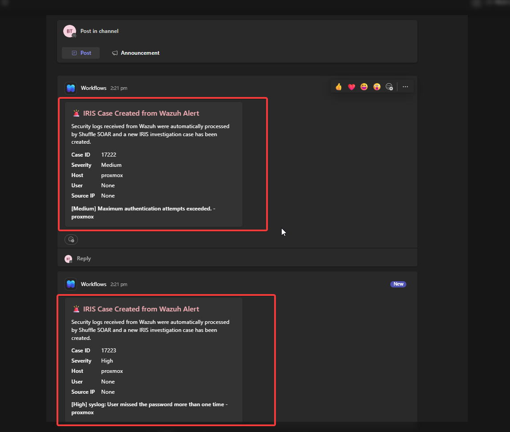

# SOC Platform Screenshots

This directory contains screenshots captured from the Automated SOC Lab environment during deployment, monitoring, alert validation, incident response, and workflow automation testing.

The screenshots provide visual evidence of the integrated SIEM, SOAR, threat intelligence, and DFIR workflows implemented within the project.

---

# Wazuh SIEM Dashboard

Displays the primary Wazuh dashboard used for security monitoring, alert visibility, and endpoint management.

  

## Validation Highlights

* Security alert visibility
* Endpoint monitoring status
* Real-time SIEM monitoring
* Threat detection overview
* Security event aggregation

---

# Wazuh Agent Monitoring

Displays enrolled monitoring agents connected to the Wazuh manager.

  

## Monitored Systems

* Windows endpoints
* Linux systems
* macOS endpoints
* Network-related infrastructure
* SOC monitoring nodes

---

# MITRE ATT&CK Alert Mapping

Demonstrates Wazuh alerts mapped against MITRE ATT&CK techniques for improved threat classification and investigation context.

  

## Detection Visibility

* ATT&CK technique mapping
* Threat categorization
* Alert classification
* Detection context enrichment
* SOC investigation support

---

# Grafana SOC Dashboard

Displays centralized security monitoring dashboards built using Grafana and OpenSearch data sources.

  

## Dashboard Features

* Centralized monitoring
* Alert visualization
* Event correlation
* SOC operational visibility
* Security event tracking

---

# Grafana Alert Panels

Displays severity-based alert panels and monitoring visualizations used for SOC event tracking and reporting.

  

## Monitoring Capabilities

* Severity-based alert tracking
* Event trend visibility
* Dashboard reporting
* Security monitoring metrics
* Operational alert visibility

---

# Shuffle SOAR Workflow Execution

Demonstrates automated SOAR workflow execution following detection events generated by Wazuh.

  

## Workflow Actions

* Automated alert processing
* IOC enrichment
* Threat intelligence lookups
* Incident automation
* Teams notification delivery
* DFIR-IRIS case creation

---

# DFIR-IRIS Case Management

Displays incident response case management and investigation tracking within DFIR-IRIS.

  

## Incident Response Features

* Incident tracking
* Automated case creation
* Investigation management
* Alert-to-case workflow integration
* SOC investigation coordination

---

# DFIR-IRIS Investigation Examples

Shows example investigation cases generated from automated security workflows and attack simulations.

  

## Investigation Workflow

* Detection-driven investigations
* Automated case enrichment
* Threat tracking
* Security event correlation
* SOC workflow validation

---

# DFIR-IRIS Observables

Displays observable and IOC management integrated within DFIR-IRIS investigations.

  

## Observable Management

* Source IP observables
* Host-based indicators
* IOC enrichment
* Threat intelligence integration
* Investigation context management

---

# Microsoft Teams Alert Notifications

Demonstrates real-time Microsoft Teams notifications generated from automated SOAR workflows.

  

## Notification Features

* Automated SOC alert delivery
* Detection summaries
* Severity visibility
* Threat context enrichment
* Real-time analyst notifications

---

# Summary

The screenshots validate the successful integration of:

* Wazuh SIEM
* Shuffle SOAR
* DFIR-IRIS
* Grafana monitoring
* Threat intelligence enrichment
* Microsoft Teams alerting
* Automated incident response workflows

The environment was used to simulate practical SOC monitoring, alert triage, enrichment, and investigation workflows within an isolated lab environment.
