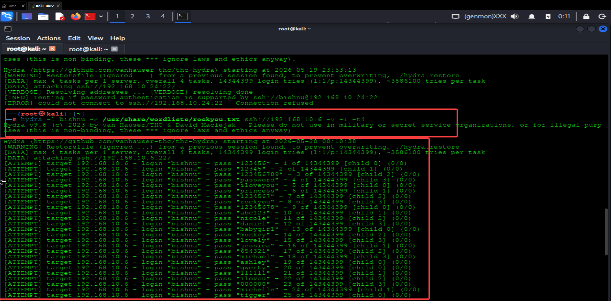
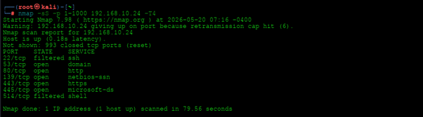
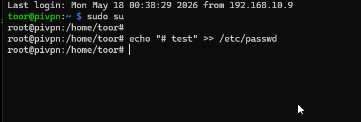
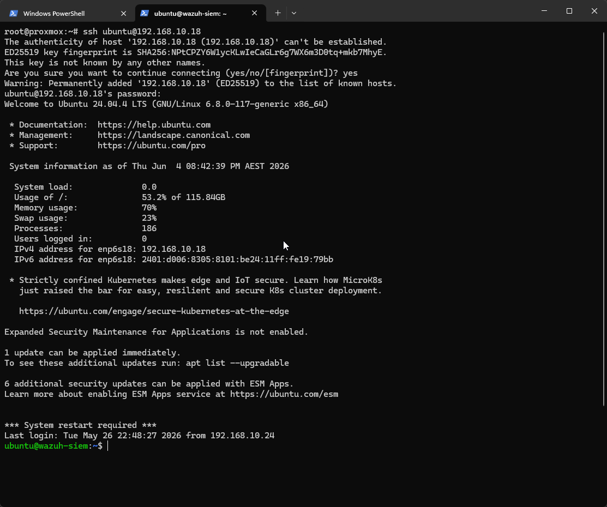

# Attack Simulations

This directory contains screenshots and evidence from controlled attack simulations performed within the Automated SOC Lab environment.

The simulations were used to validate detection visibility, SIEM monitoring, SOAR automation, incident response workflows, and threat intelligence enrichment across the integrated SOC platform.

All attack activity was conducted within isolated and authorized lab environments for educational and research purposes only.

---

# SSH Brute-Force Simulation

This simulation demonstrates SSH brute-force activity performed using Hydra against a monitored Linux endpoint.

  

## Simulation Objectives

* Generate authentication failure events
* Trigger Wazuh brute-force detections
* Validate SOAR enrichment workflows
* Generate Microsoft Teams notifications
* Automatically create DFIR-IRIS investigation cases

## Detection Results

* Multiple failed login attempts detected
* Wazuh generated authentication alerts
* Shuffle SOAR enrichment executed successfully
* Incident workflows triggered automatically
* Threat intelligence checks performed against source IPs

## MITRE ATT&CK Mapping

| Technique ID | Technique   |
| ------------ | ----------- |
| T1110        | Brute Force |

---

# Network Reconnaissance Simulation

This simulation demonstrates reconnaissance and service enumeration activity performed using Nmap against monitored systems.

  

## Simulation Objectives

* Simulate attacker reconnaissance activity
* Generate network scanning visibility
* Validate monitoring and alert generation
* Test event visibility across dashboards

## Detection Results

* Network scanning activity identified
* Security monitoring visibility confirmed
* Alert telemetry successfully ingested into Wazuh
* Reconnaissance activity visualized in dashboards

## MITRE ATT&CK Mapping

| Technique ID | Technique                |
| ------------ | ------------------------ |
| T1046        | Network Service Scanning |

---

# File Integrity Monitoring Simulation

This simulation validates Wazuh File Integrity Monitoring (FIM) capabilities by modifying monitored system files.

  

## Simulation Objectives

* Trigger Wazuh FIM alerts
* Detect unauthorized file modifications
* Validate monitoring visibility
* Confirm alert generation and workflow execution

## Detection Results

* File modifications successfully detected
* Wazuh generated FIM alerts
* Alert visibility confirmed in dashboards
* Security monitoring pipeline validated

## MITRE ATT&CK Mapping

| Technique ID | Technique         |
| ------------ | ----------------- |
| T1565        | Data Manipulation |

---

# SSH Lateral Movement Simulation

This simulation demonstrates SSH-based remote access activity between monitored systems to validate lateral movement visibility.

  

## Simulation Objectives

* Simulate remote service abuse
* Generate authentication monitoring events
* Validate lateral movement visibility
* Test alert enrichment workflows

## Detection Results

* Remote SSH access activity detected
* Cross-system authentication events monitored
* Suspicious access behavior identified
* Alert processing and enrichment validated

## MITRE ATT&CK Mapping

| Technique ID | Technique       |
| ------------ | --------------- |
| T1021        | Remote Services |

---

# Simulation Summary

The attack simulations successfully validated the SOC environment’s ability to:

* Detect suspicious authentication activity
* Monitor reconnaissance behavior
* Identify unauthorized file modifications
* Detect lateral movement activity
* Trigger automated incident workflows
* Generate real-time analyst notifications
* Enrich alerts using threat intelligence services
* Visualize events across SIEM and dashboard platforms

The simulations provided practical validation of integrated SIEM, SOAR, DFIR, and monitoring workflows within the lab environment.
